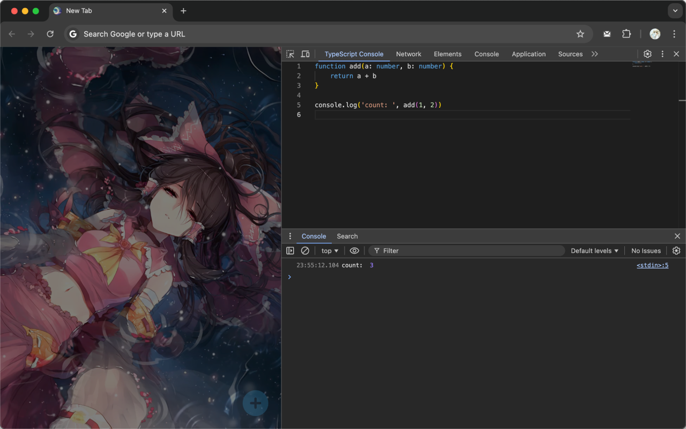
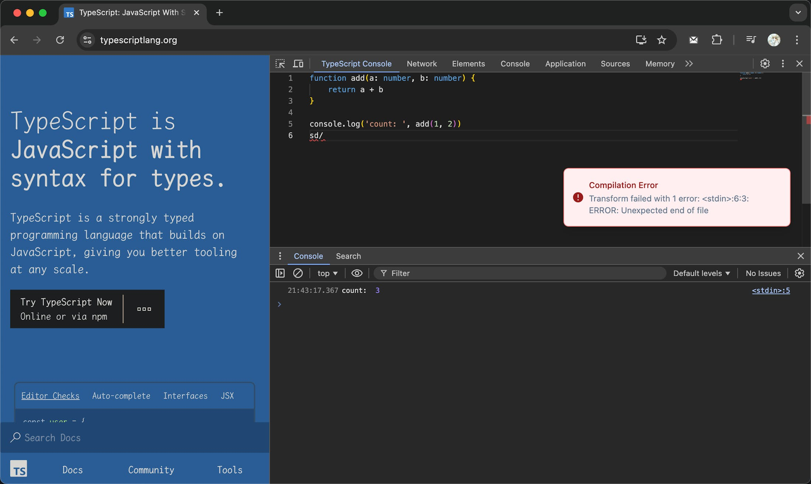
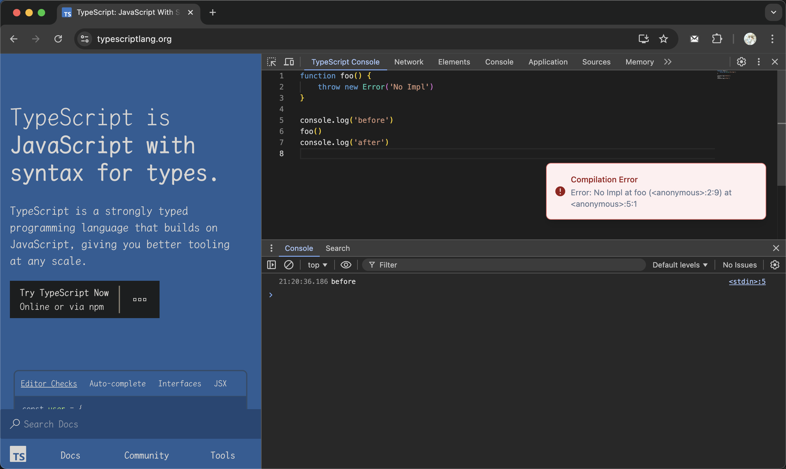
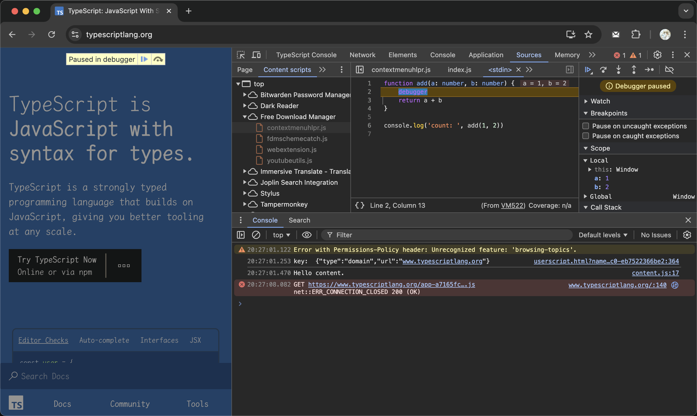

# TypeScript Console

 

Run and debug TypeScript code in the Chrome DevTools.

## Features

- [x] Write and run TypeScript directly in DevTools
- [x] Supports latest TypeScript features
- [x] Easy to use: just Cmd/Ctrl+S to run
- [x] Importing npm packages
- [ ] Custom tsconfig.json
- [ ] Adding breakpoints directly
- [ ] Snippet functionality
- [ ] AI assistant
- [ ] VIM Mode
- [x] TSX support
- [x] ~~Custom keybinding~~

## Demo

Normal operation

Operation DOM

Syntax error

Runtime error

Breakpoint debugging

