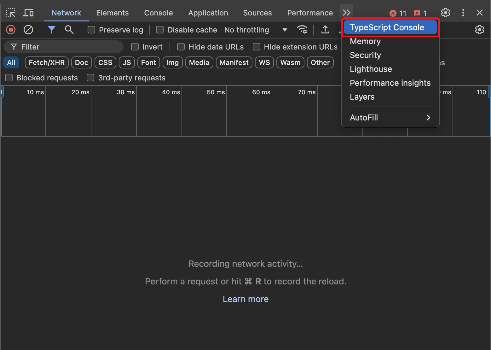
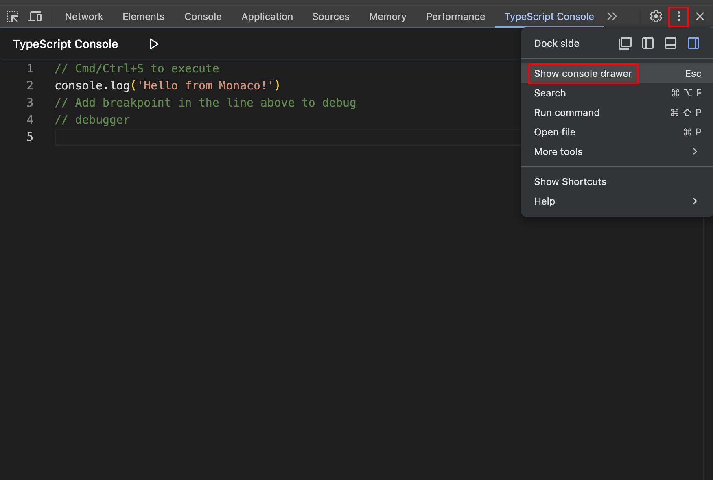
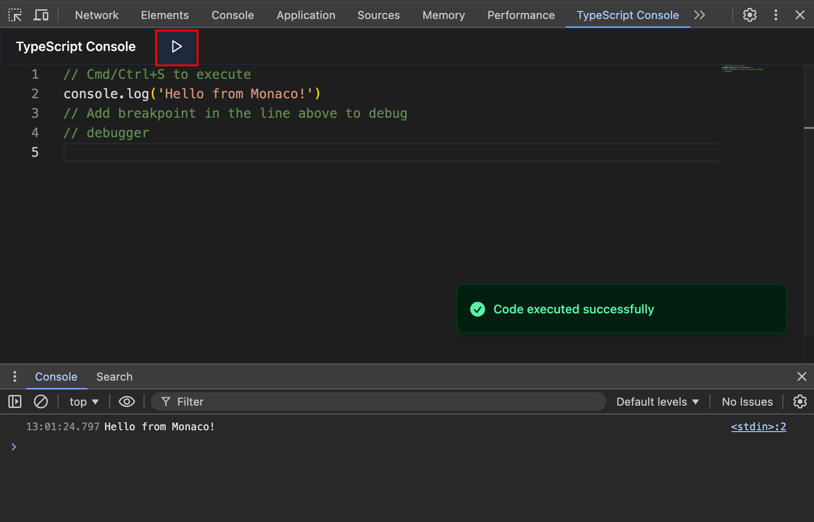

# TypeScript Console

 

Run and debug TypeScript code in the Chrome DevTools.

## Features

- [x] Write and run TypeScript directly in DevTools
- [x] Supports latest TypeScript features
- [x] Easy to use: just Cmd/Ctrl+S to run
- [x] Importing npm packages
- [ ] Custom tsconfig.json
- [ ] Adding breakpoints directly
- [ ] Snippet functionality
- [ ] AI assistant
- [ ] VIM Mode
- [x] TSX support
- [x] ~~Custom keybinding~~

## Usage

> [Demo video](https://www.youtube.com/watch?v=TkHridClbyM)

1. Install the extension from the [Chrome Web Store](https://chromewebstore.google.com/detail/jkanoakidjoklcefakbdnnhgdenddppg).
2. Open Chrome DevTools.
3. Open the "TypeScript Console" panel.
   
4. Show console drawer
   
5. Write and run TypeScript code.
   
6. Click the "Run" button or press `Cmd/Ctrl+S` to execute the code.

## Demo

Normal operation

Operation DOM

Syntax error

Runtime error

Breakpoint debugging

